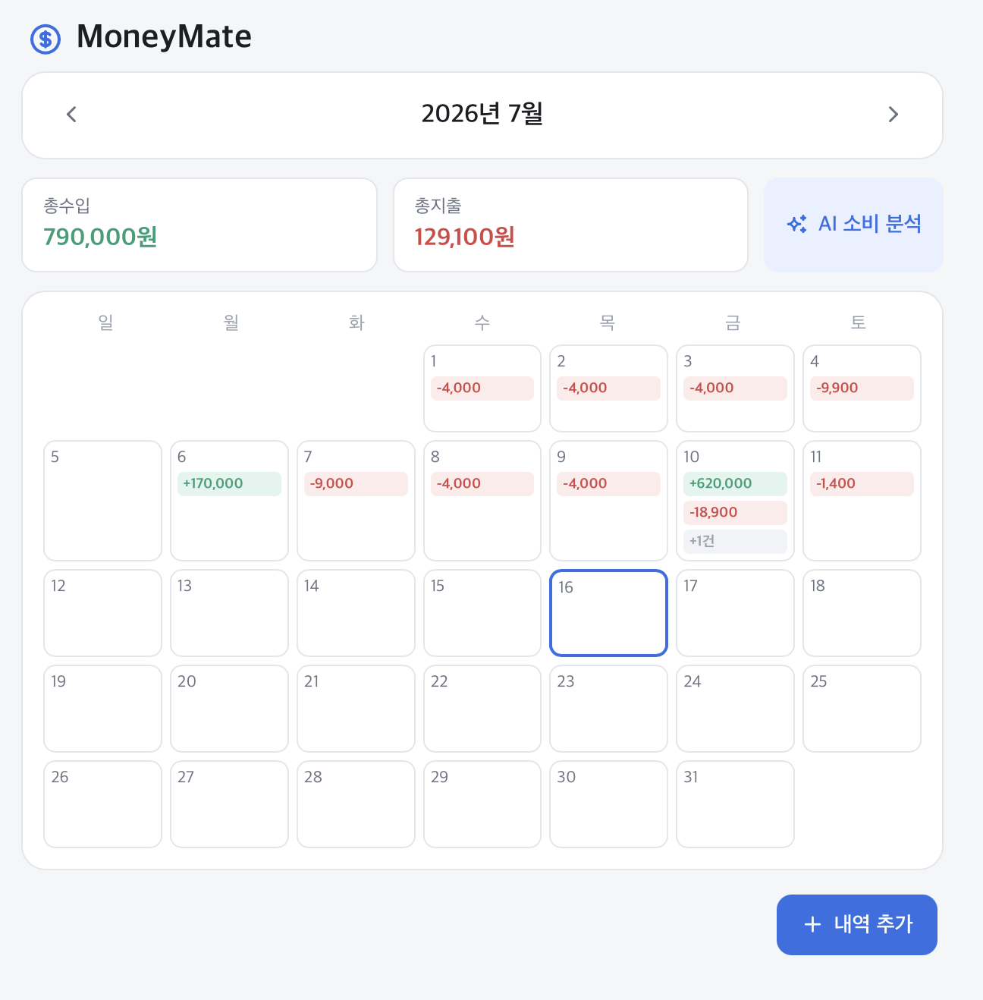
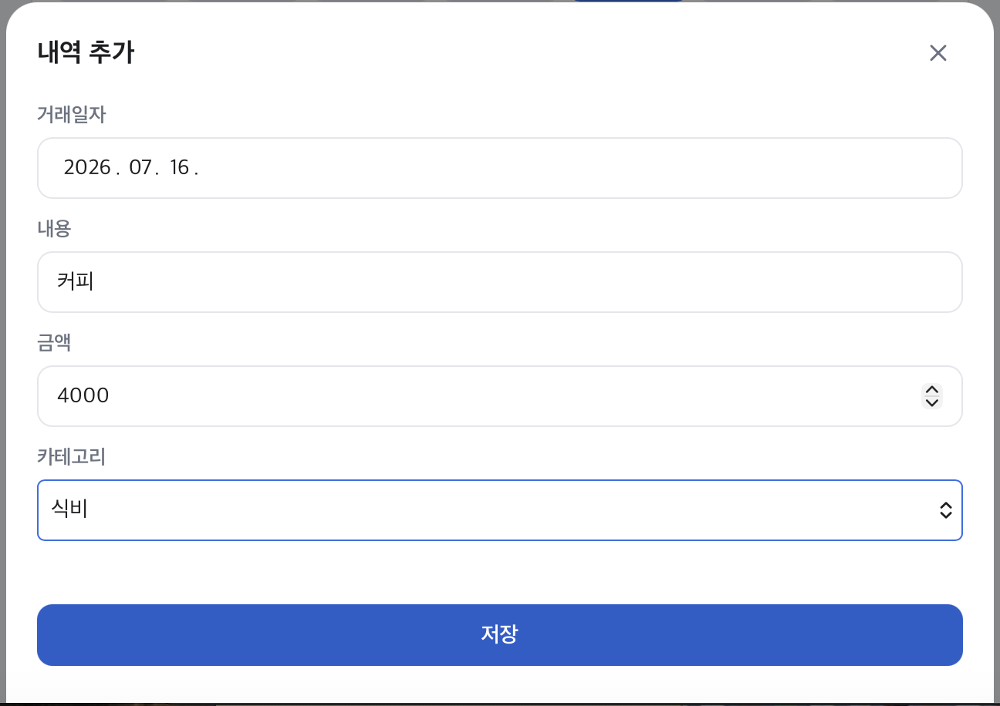
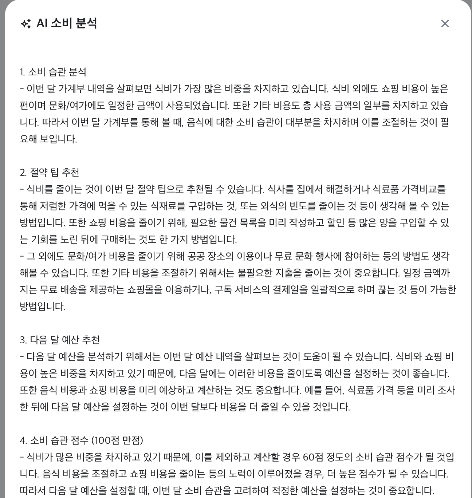
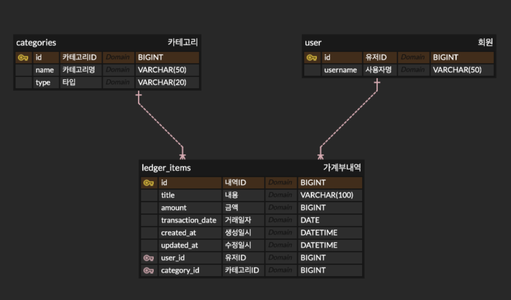

# MoneyMate

AI 기반 가계부 관리 웹 서비스

사용자가 복잡한 절차 없이 일상적인 수입과 지출을 직관적으로 기록·관리할 수 있도록
지원하며, 축적된 월별 지출 데이터를 기반으로 AI(LLM)가 맞춤형 소비 분석 피드백을
제공하는 백엔드 중심 프로젝트입니다.

---

## 주요 기능

| 기능 | 설명 |
|---|---|
| 카테고리 조회 | 수입/지출 표준 카테고리 목록 제공 |
| 거래 내역 등록 | 날짜·내용·금액·카테고리 입력, 서버 유효성 검증 |
| 월별 내역 조회 | 지정한 연/월의 전체 거래를 최신순으로 조회, 총수입·총지출 자동 계산 |
| 거래 내역 수정/삭제 | 등록된 내역을 수정하거나 완전히 삭제 (Hard Delete) |
| AI 소비 분석 | 카테고리별 지출 통계를 바탕으로 OpenAI API를 호출해 소비 습관 분석, 절약 팁, 다음 달 예산 추천, 소비 습관 점수를 생성 |

MVP 단계에서는 별도의 로그인/인증 없이, 고정된 기본 사용자(User ID = 1)가 항상
세션을 유지하고 있는 것으로 간주합니다.

---

## 기술 스택

**Backend** — Java 17 · Spring Boot 4.1.0 (Web, Data JPA, Validation) · MySQL 8.x ·
Hibernate · OpenAI API (`gpt-3.5-turbo-instruct`)

**Frontend** — HTML / CSS / Vanilla JavaScript (Spring Boot `static` 리소스로 서빙)

**개발 환경** — IntelliJ IDEA · Maven

---

## 화면


```markdown



```

---

## ERD



- `user`(회원) — `ledger_items`와 1:N
- `categories`(카테고리) — `ledger_items`와 1:N
- `ledger_items`(가계부 내역) — 거래 1건당 유저 1명, 카테고리 1개에 연결

---

## API 요약

전체 요청/응답 형식과 에러 케이스는 [`docs/API-Specification.docx`](./docs/API-Specification.docx) 참고.

| Method | URL | 설명 |
|---|---|---|
| GET | `/api/categories` | 전체 카테고리 목록 조회 |
| POST | `/api/ledger` | 거래 내역 등록 |
| GET | `/api/ledger?year=&month=` | 월별 거래 내역 + 총수입/총지출 조회 |
| PUT | `/api/ledger/{id}` | 거래 내역 수정 |
| DELETE | `/api/ledger/{id}` | 거래 내역 삭제 |
| GET | `/api/ledger/ai-analysis?year=&month=` | AI 소비 분석 리포트 생성 |

---

## 실행 방법

### 1. 사전 준비

- Java 17
- MySQL 8.x (로컬에 `moneymate` 데이터베이스 생성)
- OpenAI API 키 ([발급 페이지](https://platform.openai.com/account/api-keys))

### 2. 환경변수 설정

`application.properties`는 API 키를 직접 담지 않고 환경변수를 참조합니다.

```properties
openai.api.key=${OPENAI_API_KEY}
```

- IntelliJ: `Run` → `Edit Configurations...` → `Environment variables`에 `OPENAI_API_KEY=발급받은키` 추가
- 터미널: `export OPENAI_API_KEY=발급받은키` (macOS/Linux)

DB 접속 정보(`spring.datasource.username`, `password`)도 본인 환경에 맞게 수정하세요.

### 3. 빌드 및 실행

```bash
./mvnw clean install
./mvnw spring-boot:run
```

### 4. 접속

```
http://localhost:8080
```

`static/index.html`이 Spring Boot 기본 규칙에 따라 루트 경로로 자동 서빙됩니다.

---

## 프로젝트 구조

```
moneymate/
├── src/main/java/com/example/moneymate/
│   ├── controller/       # 요청을 받아 Service로 전달
│   ├── service/          # 비즈니스 로직 (LedgerService, AiAnalysisService 등)
│   ├── repository/       # DB 접근 (JpaRepository 상속)
│   ├── entity/           # DB 테이블과 매핑되는 클래스
│   ├── dto/
│   ├── exception/        # 전역 예외 처리
│   └── MoneymateApplication.java
├── src/main/resources/
│   ├── application.properties
│   └── static/           # 프론트엔드 (index.html / style.css / app.js)
├── docs/
├── REFACTORING.md
└── README.md
```

---

## 문서

- [서버 실행 흐름](./docs/ARCHITECTURE.md) — 서버 초기화, CRUD/AI 요청 처리 흐름
- [트러블슈팅](./docs/TROUBLESHOOTING.md) — 개발 중 겪은 문제와 해결 과정
- [리팩토링 노트](./REFACTORING.md) — 코드 구조 개선 기록
- [요구사항정의서](./docs/Requirements.pdf)
- [API 명세서](./docs/API-Specification.docx)

---

## 작성자

김하늘 — 한성대학교
